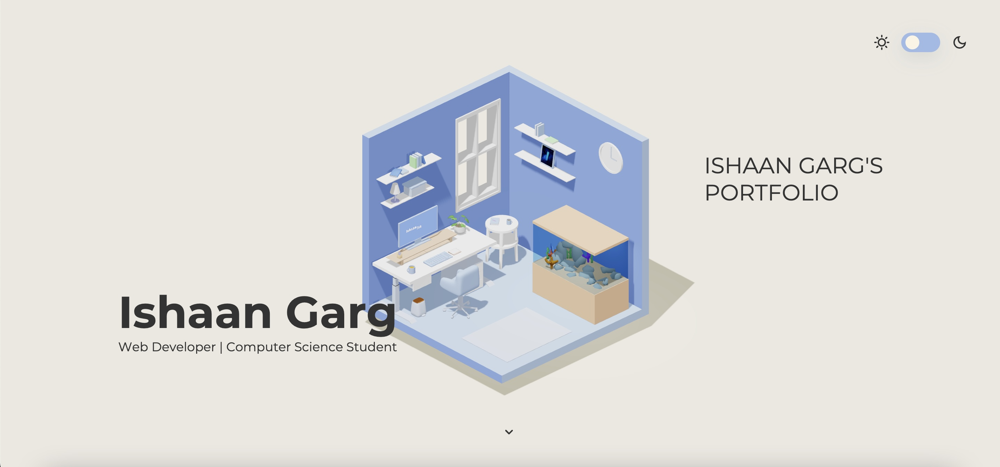

# Ishaantek.com

 
 
The most powerful portfolio built with three.js ☄️

👉 Check out the [live demo](https://www.ishaantek.com/)

With this portfolio you can showcase your skills like a pro. Give details about you, show off your projects, and add your own contact me section all in an interactive website.

Made by [Ishaan Garg](https://twitter.com/ishaantek)

[comment]: <> (Product Hunt)

## Table of contents
- [Ishaantek.com](#Ishaantek.com)
  - [Table of contents](#table-of-contents)
  - [Self-hosting Ishaantek](#self-hosting-Ishaantek)
  - [Libraries used](#libraries-used)

## Self-hosting Ishaantek
You can run Ishaantek.com locally on your computer.

1. Download the code. In the web version of GitHub, you can do that by clicking the green "Code" button, and then "Download ZIP".
2. Unzip it, and open it in code.
3. Run the command `npm i` to install all the dependencies.
4. Run the command `npm run dev` to start the website in a live server.

## Libraries used

- [Three.js](https://threejs.org/) - to render the graphics and 3D objects on a canvas in the web browser
- [GSAP](https://greensock.com/gsap/) - for the scripted animation
- [ScrollTrigger](https://greensock.com/docs/v3/Plugins/ScrollTrigger) - for the scroll-based animations
- [Vite](https://vitejs.dev/) - a webpack to bundle the JavaScript applications
#

Feel free to reach out to me through email at ishaan@ishaantek.com or [on Twitter](https://twitter.com/ishaantek) if you have any questions or feedback! Hope you find this useful 💙
